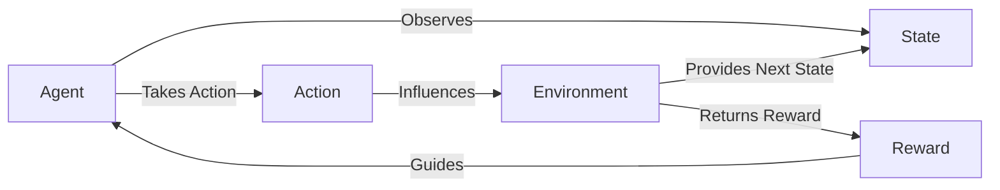

```markdown
## **Lesson 1.2: Key Components of RL**

### **Learning Objectives**
- **Understand the core components** of Reinforcement Learning: Agent, Environment, State, Action, Reward.
- **Describe the interactions** between these components.
- **Visualize the RL framework** through diagrams and code examples.
- **Implement a basic interaction loop** between an agent and the environment.
- **Recognize the importance of each component** in designing effective RL algorithms.

### **Description**
In this lesson, we'll dissect the fundamental building blocks of Reinforcement Learning. Grasping these components is crucial for designing and implementing effective RL algorithms. We'll visualize the RL process, explore each component in detail, and implement a basic interaction loop to solidify your understanding. By the end of this lesson, you'll have a clear picture of how agents interact with their environments to learn optimal behaviors.

### **Core Components of RL**

1. **Agent**
   - The learner or decision-maker.
   - Interacts with the environment by taking actions.
   - Aims to maximize cumulative rewards over time.

2. **Environment**
   - The external system that the agent interacts with.
   - Provides feedback in the form of rewards and new states.
   - Can be simulated (e.g., OpenAI Gym) or real-world.

3. **State (s)**
   - A representation of the current situation of the environment.
   - Can be fully observable or partially observable.
   - Defines the information available to the agent at any given time.

4. **Action (a)**
   - Choices available to the agent.
   - Can be discrete (e.g., left or right) or continuous (e.g., steering angles).
   - Determines how the agent interacts with the environment.

5. **Reward (r)**
   - Immediate feedback from the environment based on the action taken.
   - Guides the agent towards desired behaviors.
   - Can be positive (rewards) or negative (penalties).

### **Interactions Between Components**

The RL process can be visualized as a loop:

1. **Observation:** The agent observes the current state of the environment.
2. **Decision:** Based on the state, the agent selects an action.
3. **Execution:** The agent performs the action in the environment.
4. **Feedback:** The environment returns a reward and the next state.
5. **Update:** The agent updates its knowledge (e.g., policy, value function) based on the reward and new state.
6. **Repeat:** The loop continues until a termination condition is met (e.g., episode ends).

### **Visualizing the RL Framework**



*Figure: The Reinforcement Learning Loop - Agent interacts with Environment, receives Reward and next State.*

### **Practical Example: Agent-Environment Interaction**

Let's simulate a single step interaction between an agent and the CartPole environment.

#### **Step 1: Setting Up the Environment**
First, ensure you have the necessary libraries installed. You can install OpenAI Gym using pip if you haven't already:

```python
!pip install gym
```

#### **Step 2: Simulating an Interaction**

We'll create the CartPole environment, reset it to start, take a specific action, and observe the results.

```python
import gym

# Initialize the CartPole environment
env = gym.make('CartPole-v1')
state = env.reset()

print(f"Initial State: {state}")

# Agent selects an action (e.g., move right)
action = 1  # 0: Move Left, 1: Move Right
print(f"Agent Action: {action}")

# Environment responds to the action
next_state, reward, done, info = env.step(action)

print(f"Next State: {next_state}")
print(f"Reward: {reward}")
print(f"Done: {done}")
print(f"Info: {info}")

# Close the environment
env.close()
```

#### **Step 3: Understanding the Code**
- **Environment:** The `CartPole-v1` environment simulates a pole balanced on a cart. The goal is to prevent the pole from falling by moving the cart left or right.
- **State:** Represents the current situation of the environment, including:
  - Cart position
  - Cart velocity
  - Pole angle
  - Pole velocity at the tip
- **Action:** The possible moves the agent can take:
  - `0`: Push cart to the left
  - `1`: Push cart to the right
- **Reward:** Feedback from the environment based on the action taken. Typically, +1 for every step the pole remains upright.
- **Done:** Indicates whether the episode has ended (e.g., the pole has fallen or the cart has moved out of bounds).
- **Info:** Additional diagnostic information (can be ignored for basic RL tasks).

### **Extending the Example: Running a Single Interaction**

To better understand the flow, let's run a single interaction loop where the agent takes an action and the environment responds.

```python
import gym

# Initialize the CartPole environment
env = gym.make('CartPole-v1')
state = env.reset()

print("=== Starting a Single Interaction ===")
print(f"Initial State: {state}")

# Agent selects an action
action = env.action_space.sample()  # Random action for demonstration
print(f"Agent Action: {action}")

# Environment responds to the action
next_state, reward, done, info = env.step(action)

print(f"Next State: {next_state}")
print(f"Reward: {reward}")
print(f"Done: {done}")
print(f"Info: {info}")

# Close the environment
env.close()
```

*Run the above code cell to observe a single interaction between the agent and the environment.*

### **Interactive Activity**
1. **Diagram Creation:** Create your own diagram illustrating the RL loop using Mermaid or any other diagram tool.
2. **Code Modification:** Modify the action selection in the example to always push left (`action = 0`) and observe the changes in the output.
3. **Exploration:**
   - Experiment with different actions and record the resulting states and rewards.
   - Observe how different actions influence the environment's response.

### **Quick Exercise: Implementing a Basic Interaction Loop**

Implement a loop where the agent takes random actions until the episode ends. Track the total reward and the number of steps taken.

```python
import gym

# Initialize the CartPole environment
env = gym.make('CartPole-v1')
state = env.reset()

total_reward = 0
steps = 0
done = False

while not done:
    env.render()  # Render the environment
    action = env.action_space.sample()  # Take a random action
    next_state, reward, done, info = env.step(action)
    total_reward += reward
    steps += 1

print(f"Episode finished after {steps} steps with total reward {total_reward}")

# Close the environment
env.close()
```

*Run the above code cell to see the CartPole in action with a random policy.*

### **Explanation**
In this extended example:
- The agent interacts with the environment by taking random actions until the episode ends.
- **Rendering** visualizes the environment, allowing you to see the cart and pole.
- **Total Reward** accumulates the rewards received in each step, giving an indication of how long the pole was balanced.
- **Steps:** Counts the number of actions taken before the episode ended.

### **Summary**
Understanding these core components and their interactions is essential for building and implementing RL agents. Each component plays a vital role:
- The **Agent** makes decisions based on the **State**.
- The **Environment** responds to actions with new states and rewards.
- **Rewards** guide the agent towards optimal behavior.

As we progress, we'll delve deeper into each component, exploring how agents learn to make better decisions over time through various RL algorithms.

### **Interactive Discussion**
- **Question:** How does the choice of actions influence the agent's ability to maximize rewards?
  
  **Answer:** The choice of actions directly affects the rewards the agent receives. By selecting actions that lead to higher rewards, the agent reinforces behaviors that are beneficial for achieving its goals. Conversely, actions that result in lower or negative rewards discourage the agent from repeating those behaviors.

- **Activity:** Identify an RL application in your field of interest and discuss how the agent interacts with its environment.
  
  **Example Response:** *In autonomous driving, an RL agent can be used to make real-time decisions such as steering, accelerating, or braking. The environment includes the road conditions, traffic signals, and other vehicles. Rewards are based on factors like safety, efficiency, and adherence to traffic rules.*

### **Further Reading and Resources**
- **"Reinforcement Learning: An Introduction" by Richard S. Sutton and Andrew G. Barto** - A comprehensive textbook on RL fundamentals.
- **OpenAI Gym Documentation:** [https://gym.openai.com/docs/](https://gym.openai.com/docs/)
- **DeepMind's RL Courses:** [https://deepmind.com/learning-resources](https://deepmind.com/learning-resources)
- **Interactive RL Tutorials:** [https://spinningup.openai.com/en/latest/](https://spinningup.openai.com/en/latest/)

---

**Excellent work on completing Lesson 1.2!** You've gained a solid understanding of the key components that make up the Reinforcement Learning framework and how they interact to enable learning. In the next lesson, we'll set up your Python environment to start implementing RL algorithms hands-on.
```